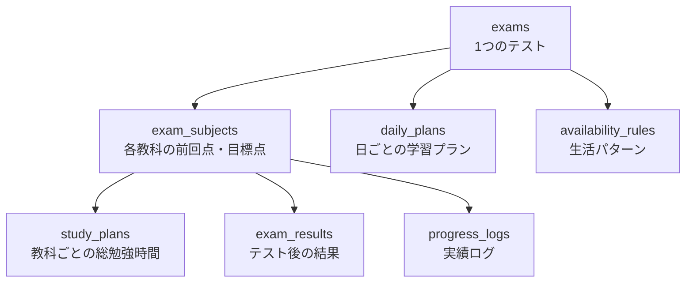

# DATA_STRUCTURES

## 方針
- 保存単位は `テスト` を中心にする
- 日次の細かすぎる行動ログはMVPでは持たない
- 次回提案に必要な最小構造だけを持つ
- MVPでも、責務が異なるものはテーブルを分ける
- 転職用ポートフォリオとして、検索・集計・拡張しやすい構造を優先する

## DB可視化

### MVPの保存モデル


### テーブルの役割

- `exams`
  - テスト自体の基本情報
- `exam_subjects`
  - そのテストに含まれる科目と目標値
- `study_plans`
  - 教科ごとの総勉強時間
- `daily_plans`
  - 日ごとの学習計画
- `progress_logs`
  - 実績ログ
- `exam_results`
  - テスト後の結果
- `availability_rules`
  - 自動配分用の生活パターン



### ねらい

- `exams`
  - テスト自体の状態遷移を管理する
  - `active → finished` の遷移は cron ではなく**アクセス時の遅延評価**で行う。画面表示時に `end_date < 今日` を判定して `status` を更新する（MVPでの方針）
- `exam_subjects`
  - 「科目そのもの」ではなく「そのテストにおける科目情報」を表す
  - `normalized_name` は引き継ぎ時の科目名マッチングに使う検索用フィールド。表記ゆれ（「数学」「数」「Math」等）を小文字・全角→半角変換などで正規化した値を保持する
- `daily_plans`
  - 日付単位の表示・更新をしやすくする
  - `exam_id` と `exam_subject_id` の両方を持つのは、RLS ポリシーで `exam_id` を直接参照できるようにするため。`exam_subject_id` だけだと JOIN が必要になりポリシー記述が複雑になる
  - 両者が同じテストを指すことは DB 制約で保証できないため、**挿入・更新時にアプリ層で `exam_subjects.exam_id = daily_plans.exam_id` を検証すること**
  - UNIQUE制約 `(exam_id, exam_subject_id, date)` は「同日・同科目は1行に合算する」設計を意味する。1日に同科目を複数セッション分けて登録するユースケースは MVPでは非対応とする（この制約が将来の拡張を妨げる場合は `display_order` を含めた複合 UNIQUE に変更する）
- `progress_logs`
  - 実績は追記型で別保存する。行は**イミュータブル**（更新不可）な設計のため `updated_at` を持たない
  - 誤入力の訂正は当該行の物理削除と再登録で行う
  - `exam_id` と `exam_subject_id` の両方を持つ。理由と整合性担保の責任は `daily_plans` と同様
- 導出値
  - `logged_minutes` の累計
  - `remaining_minutes`
  - 進捗率
  は保存せず、`progress_logs` 集計で出す
- `exam_results.actual_study_minutes`
  - `progress_logs` の集計で導出可能だが、テスト終了後に進捗ログを削除したユースケースでも振り返り値を保持するためにスナップショットとして持つ
  - **取得タイミング**: 結果入力画面を開いた時点で `progress_logs` を集計した値を初期値として表示し、ユーザーが保存した時点で確定させる。保存後は `progress_logs` と独立した値として扱い、再集計で上書きしない
- `ExamResult` の「入力済み」判定
  - `exam_subjects` の全科目に対応する `exam_results` が揃っている（全件存在する）状態を「入力済み」とする
  - 1科目でも未入力なら「未入力」として扱い、ホームで結果入力を促す
- `source = manual` の `daily_plans` 行
  - 再計算で上書きしないルールはアプリ層の責任。DB 制約では保護できないため、配分再計算ロジックで `source = 'manual'` の行を必ずスキップすること。MVPでは RLS の WITH CHECK やトリガーによる制約化は複雑性を避けて見送る

### jsonb フィールドのスキーマ

#### `exams.schedule_days`

テスト期間中の科目割り当て情報。MVPでは exams に JSON で保持。

```json
[
  {
    "date": "2026-06-20",
    "subjects": ["math", "science"]
  },
  {
    "date": "2026-06-21",
    "subjects": ["japanese", "english", "history"]
  }
]
```

- `date`: ISO 8601 形式の日付文字列
- `subjects`: `exam_subjects.subject_id`（アプリ定義の固定文字列）の配列
  - `daily_plans` や `progress_logs` で使う `exam_subject_id`（uuid）に変換するには `exam_subjects` テーブルとの JOIN が必要

#### `availability_rules.club_days`

部活がある曜日の一覧。

```json
["mon", "wed", "fri"]
```

- 値は `mon / tue / wed / thu / fri / sat / sun` の固定7値
- MVPでは JSON 保持。将来的には `text[]` 型または boolean カラム7本への正規化を検討

### 補足

- `schedule_days` は MVP では `exams` に JSON で保持してよい
- 理由:
  - テスト期間内の補助情報であり、独立検索の必要度が低い
  - 一方で `exam_subjects` や `daily_plans` は検索・更新単位として独立価値が高い
- `exams.version` は楽観的ロック用。初期値は `DEFAULT 1`。更新時に `UPDATE ... WHERE id = ? AND version = ?` を使い、競合時はエラーとする。スキーマ変更時の migration バージョン管理とは別物
- `progress_logs.logged_at` と `created_at` はどちらも `DEFAULT now()` で DB が設定する。`logged_at` は「ユーザーが記録した」と認識する操作時刻、`created_at` は行挿入の監査用。MVP ではほぼ同値になるが、将来の非同期送信（オフライン記録など）に備えて分離している。アプリからの上書きは禁止する

## テーブル定義

### users

| 項目 | 型 | 必須 | 意味 | 例 | 備考 |
|---|---|---|---|---|---|
| `id` | `uuid` | はい | ユーザーを一意に識別するID | `8f3...` | Supabase Auth の `auth.users.id` を参照 |
| `email` | `text` | いいえ | ログインユーザーのメールアドレス | `user@example.com` | ゲスト利用時は未保持でもよい。RLS で本人の uid でのみ参照可能にすること。`auth.users` に既存のため、本テーブルに複製保持する必要性を実装前に再確認すること |

### exams

| 項目 | 型 | 必須 | 意味 | 例 | 備考 |
|---|---|---|---|---|---|
| `id` | `uuid` | はい | テストを一意に識別するID | `exam_001` | 主キー |
| `user_id` | `uuid` | はい | このテストの所有者 | `8f3...` | `users.id` を参照 |
| `version` | `int` | はい | 楽観的ロック用の版番号 | `1` | `DEFAULT 1`。更新時に `WHERE version = ?` で競合検出 |
| `name` | `text` | はい | テスト名 | `2学期中間テスト` | ユーザー表示に使う |
| `term_type` | `text` | はい | 学期区分 | `midterm` | `中間 / 期末 / その他` 相当 |
| `start_date` | `date` | はい | テスト開始日 | `2026-06-20` | ホームの残日数計算に使う |
| `end_date` | `date` | はい | テスト終了日 | `2026-06-22` | `finished` 判定に使う。`CHECK (end_date >= start_date)` |
| `status` | `text` | はい | テストの進行状態 | `planning` | `planning / active / finished`。CHECK制約で値域を保証。`archived` は MVP 後の拡張候補（現時点では未定義） |
| `planning_mode` | `text` | はい | 配分作成方法 | `auto` | `auto / manual` |
| `schedule_days` | `jsonb` | いいえ | テスト期間中の勉強可能日情報 | スキーマは「jsonb フィールドのスキーマ」参照 | MVPでは JSON 保持 |
| `created_at` | `timestamptz` | はい | 作成日時 | `2026-04-22T10:00:00Z` | 監査用 |
| `updated_at` | `timestamptz` | はい | 最終更新日時 | `2026-04-22T10:30:00Z` | 更新順表示にも使える |

### exam_subjects

| 項目 | 型 | 必須 | 意味 | 例 | 備考 |
|---|---|---|---|---|---|
| `id` | `uuid` | はい | テスト内の科目行を一意に識別するID | `exsub_001` | 主キー |
| `exam_id` | `uuid` | はい | どのテストに属する科目か | `exam_001` | `exams.id` を参照 |
| `subject_id` | `text` | はい | 科目の安定識別子 | `math` | アプリ定義の固定文字列。表示名変更後も不変。`(exam_id, subject_id)` でユニーク |
| `subject_name` | `text` | はい | 科目の表示名 | `数学` | UI 表示用 |
| `normalized_name` | `text` | はい | 表記ゆれ吸収後の検索用名称 | `数学` | 引き継ぎ時の科目マッチングに使う。小文字化・全角→半角変換などを施した値 |
| `previous_score` | `int` | いいえ | 前回の点数 | `72` | 引き継ぎ用。null の場合は配分ロジックで 50 として補完 |
| `previous_study_minutes` | `int` | いいえ | 前回この科目に使った勉強時間 | `180` | 配分計算入力。null の場合は 0 として補完 |
| `target_score` | `int` | はい | 今回の目標点数 | `80` | 目標入力画面で設定 |
| `display_order` | `int` | はい | UI 上の表示順 | `1` | 作成順に1始まりの連番。並び替え時はアプリ層で全行を更新 |
| `created_at` | `timestamptz` | はい | 作成日時 | `2026-04-22T10:00:00Z` | 監査用 |
| `updated_at` | `timestamptz` | はい | 最終更新日時 | `2026-04-22T10:10:00Z` | 変更追跡用 |

### study_plans

| 項目 | 型 | 必須 | 意味 | 例 | 備考 |
|---|---|---|---|---|---|
| `id` | `uuid` | はい | 教科別配分の識別子 | `plan_001` | 主キー |
| `exam_subject_id` | `uuid` | はい | どの科目の配分か | `exsub_001` | `exam_subjects.id` を参照 |
| `planned_minutes` | `int` | はい | その科目に充てる総勉強時間 | `240` | 分単位。配分ロジックで10分刻みに丸め済みのため最低10分 |
| `planned_ratio` | `numeric(5,4)` | はい | 全体に対する配分比率 | `0.3200` | 整数部1桁・小数部4桁（0.0000〜1.0000）。float は浮動小数点誤差が出るため numeric を使う。科目間の合計が 1.0 になることはアプリ層で保証。並行リクエスト時の整合は `exams.version` による楽観的ロックと組み合わせて管理する |
| `reason` | `text` | いいえ | その配分になった理由 | `前回未達で目標差分が大きい` | 説明表示用。システム生成値のみ入力するため文字数制限は不要 |
| `created_at` | `timestamptz` | はい | 作成日時 | `2026-04-22T10:15:00Z` | 監査用 |
| `updated_at` | `timestamptz` | はい | 最終更新日時 | `2026-04-22T10:15:00Z` | 再計算時に更新 |

### daily_plans

| 項目 | 型 | 必須 | 意味 | 例 | 備考 |
|---|---|---|---|---|---|
| `id` | `uuid` | はい | 日ごとの学習プラン行ID | `daily_001` | 主キー |
| `exam_id` | `uuid` | はい | どのテストの日程か | `exam_001` | `exams.id` を参照。RLS 直参照用に保持 |
| `exam_subject_id` | `uuid` | はい | どの科目の行か | `exsub_001` | `exam_subjects.id` を参照。`exam_id` との整合性はアプリ層で保証 |
| `date` | `date` | はい | その学習を行う日 | `2026-06-10` | ホームの「今日やること」に使う |
| `planned_minutes` | `int` | はい | その日に予定している勉強時間 | `60` | 分単位。最低10分（配分ロジックの10分刻み丸めに準拠） |
| `source` | `text` | はい | 自動生成か手動追加か | `auto` | `auto / manual` |
| `display_order` | `int` | はい | 同日の中での表示順 | `2` | 作成順に1始まりの連番。並び替え時はアプリ層で当日分を更新 |
| `created_at` | `timestamptz` | はい | 作成日時 | `2026-04-22T10:20:00Z` | 監査用 |
| `updated_at` | `timestamptz` | はい | 最終更新日時 | `2026-04-22T10:20:00Z` | 手動編集時に更新 |

### progress_logs

| 項目 | 型 | 必須 | 意味 | 例 | 備考 |
|---|---|---|---|---|---|
| `id` | `uuid` | はい | 実績ログの識別子 | `log_001` | 主キー |
| `exam_id` | `uuid` | はい | どのテストに対する実績か | `exam_001` | `exams.id` を参照。RLS 直参照用に保持。`exam_subject_id` との整合性はアプリ層で保証 |
| `exam_subject_id` | `uuid` | はい | どの科目の実績か | `exsub_001` | `exam_subjects.id` を参照 |
| `logged_minutes` | `int` | はい | 実際に勉強した時間 | `45` | 分単位 |
| `memo` | `text` | いいえ | 補足メモ | `問題集を2章進めた` | 任意入力。Zod バリデーションで `max(500)` を必須設定 |
| `logged_date` | `date` | はい | どの日の実績として扱うか | `2026-06-10` | 日付集計用。翌朝に前日分を記録するケースに対応 |
| `logged_at` | `timestamptz` | はい | 記録操作を行った時刻 | `2026-06-10T20:10:00Z` | `DEFAULT now()` で DB が設定。アプリからの上書き禁止 |
| `created_at` | `timestamptz` | はい | DB 行挿入日時 | `2026-06-10T20:10:01Z` | `DEFAULT now()`。監査用 |

### exam_results

| 項目 | 型 | 必須 | 意味 | 例 | 備考 |
|---|---|---|---|---|---|
| `id` | `uuid` | はい | 結果行の識別子 | `result_001` | 主キー |
| `exam_subject_id` | `uuid` | はい | どの科目の結果か | `exsub_001` | `exam_subjects.id` を参照 |
| `actual_score` | `int` | はい | 実際の点数 | `78` | 結果入力画面で使う |
| `actual_study_minutes` | `int` | いいえ | 実際に使った総勉強時間 | `220` | 結果入力時に `progress_logs` を集計した値を初期値として表示し、ユーザー保存で確定。保存後は再集計で上書きしない |
| `note` | `text` | いいえ | 振り返りメモ | `計算ミスが多かった` | 任意入力。Zod バリデーションで `max(500)` を必須設定 |
| `created_at` | `timestamptz` | はい | 作成日時 | `2026-06-25T12:00:00Z` | 監査用 |
| `updated_at` | `timestamptz` | はい | 最終更新日時 | `2026-06-25T12:05:00Z` | 再編集時に更新 |

### availability_rules

| 項目 | 型 | 必須 | 意味 | 例 | 備考 |
|---|---|---|---|---|---|
| `id` | `uuid` | はい | 生活パターン設定の識別子 | `rule_001` | 主キー |
| `exam_id` | `uuid` | はい | どのテスト用の生活ルールか | `exam_001` | `exams.id` を参照 |
| `weekday_club_minutes` | `int` | はい | 部活がある平日に使える勉強時間 | `60` | 分単位 |
| `weekday_no_club_minutes` | `int` | はい | 部活がない平日に使える勉強時間 | `120` | 分単位 |
| `weekend_minutes` | `int` | はい | 土日に使える勉強時間 | `180` | 分単位 |
| `club_days` | `jsonb` | はい | 部活がある曜日一覧 | スキーマは「jsonb フィールドのスキーマ」参照 | MVPでは JSON 保持 |
| `study_start_date` | `date` | はい | 勉強開始日 | `2026-06-01` | 配分計算の開始点。`study_start_date <= exams.start_date`（テスト開始日以前から勉強を始められる）をアプリ層で検証 |
| `pre_exam_rest_mode` | `boolean` | はい | テスト前1週間を部活なし扱いにするか | `true` | REQUIREMENTS の詳細設定項目「テスト1週間前は部活なし扱い」に対応。自動配分計算時に適用 |
| `created_at` | `timestamptz` | はい | 作成日時 | `2026-04-22T10:05:00Z` | 監査用 |
| `updated_at` | `timestamptz` | はい | 最終更新日時 | `2026-04-22T10:05:00Z` | 変更追跡用 |

## 制約定義

### UNIQUE 制約

| テーブル | カラム | 意味 |
|---|---|---|
| `exam_subjects` | `(exam_id, subject_id)` | 同一テスト内で科目の重複を禁止する |
| `daily_plans` | `(exam_id, exam_subject_id, date)` | 同日・同科目は1行に合算する（MVP では複数セッション分割は非対応） |
| `study_plans` | `(exam_subject_id)` | 科目に対して配分は1件のみ（1:1関係を DB でも保証） |
| `exam_results` | `(exam_subject_id)` | 科目に対して結果は1件のみ（1:0..1 関係を DB でも保証） |
| `availability_rules` | `(exam_id)` | テストに対して生活ルールは1件のみ（1:1関係を DB でも保証） |

### CHECK 制約

| テーブル | カラム | 制約 |
|---|---|---|
| `exams` | `end_date`, `start_date` | `CHECK (end_date >= start_date)` |
| `exams` | `status` | `CHECK (status IN ('planning', 'active', 'finished'))` |
| `exams` | `planning_mode` | `CHECK (planning_mode IN ('auto', 'manual'))` |
| `exam_subjects` | `target_score` | `CHECK (target_score BETWEEN 0 AND 100)` |
| `exam_subjects` | `previous_score` | `CHECK (previous_score BETWEEN 0 AND 100)` |
| `exam_subjects` | `previous_study_minutes` | `CHECK (previous_study_minutes >= 0)` |
| `exam_results` | `actual_score` | `CHECK (actual_score BETWEEN 0 AND 100)` |
| `exam_results` | `actual_study_minutes` | `CHECK (actual_study_minutes >= 0)` |
| `study_plans` | `planned_minutes` | `CHECK (planned_minutes >= 10)` — 配分ロジックの10分刻み丸めに準拠 |
| `study_plans` | `planned_ratio` | `CHECK (planned_ratio BETWEEN 0 AND 1)` |
| `daily_plans` | `planned_minutes` | `CHECK (planned_minutes >= 10)` — 配分ロジックの10分刻み丸めに準拠 |
| `daily_plans` | `source` | `CHECK (source IN ('auto', 'manual'))` |
| `progress_logs` | `logged_minutes` | `CHECK (logged_minutes >= 0)` |
| `availability_rules` | `weekday_club_minutes` | `CHECK (weekday_club_minutes >= 0)` |
| `availability_rules` | `weekday_no_club_minutes` | `CHECK (weekday_no_club_minutes >= 0)` |
| `availability_rules` | `weekend_minutes` | `CHECK (weekend_minutes >= 0)` |

### アプリ層で保証する整合性（DB 制約で表現できないもの）

| 制約 | 保証するタイミング |
|---|---|
| `daily_plans.exam_id` と `daily_plans.exam_subject_id` が同じテストを指すこと | 行の挿入・更新時 |
| `progress_logs.exam_id` と `progress_logs.exam_subject_id` が同じテストを指すこと | 行の挿入・更新時 |
| `availability_rules.study_start_date <= exams.start_date` | 保存時 |
| `study_plans` の `planned_ratio` の合計が 1.0 になること | 配分計算・再計算時。並行リクエスト時の整合は `exams.version` による楽観的ロックと組み合わせる |
| `source = 'manual'` の `daily_plans` 行を再計算で上書きしないこと | 自動配分の再生成時 |
| `memo` / `note` が 500 文字以内であること | Zod スキーマでバリデーション（`max(500)`） |

### CASCADE DELETE 方針

`exams` を削除したとき、紐づく全データを連鎖削除する。

| FK | 方針 |
|---|---|
| `exam_subjects.exam_id` | `ON DELETE CASCADE` |
| `daily_plans.exam_id` | `ON DELETE CASCADE` |
| `progress_logs.exam_id` | `ON DELETE CASCADE` |
| `availability_rules.exam_id` | `ON DELETE CASCADE` |
| `study_plans.exam_subject_id` | `ON DELETE CASCADE` |
| `exam_results.exam_subject_id` | `ON DELETE CASCADE` |
| `daily_plans.exam_subject_id` | `ON DELETE CASCADE` |
| `progress_logs.exam_subject_id` | `ON DELETE CASCADE` |
| `exams.user_id` | `ON DELETE CASCADE`（ユーザー退会時に全テストを削除） |

> **注意**: `exam_subjects` を削除すると `study_plans`・`exam_results`・`daily_plans`・`progress_logs` が連鎖削除される。また `daily_plans`・`progress_logs` は `exams` 経由でも `exam_subjects` 経由でも CASCADE 対象になるが、PostgreSQL は重複削除を正しく処理する。科目の削除 API は UI 上で確認ダイアログを必ず挟み、削除操作をアプリ層ログに記録すること。

## インデックス設計

| テーブル | カラム | 用途 |
|---|---|---|
| `exams` | `(user_id)` | ホーム表示・テスト一覧のユーザー別取得 |
| `exams` | `(user_id, status)` | status でフィルタして active/planning を絞り込む |
| `exam_subjects` | `(exam_id)` | テスト内科目一覧の取得 |
| `daily_plans` | `(exam_id, date)` | 「今日やること」取得（日付絞り込み） |
| `progress_logs` | `(exam_id, logged_date)` | 日別・テスト別の進捗集計 |
| `progress_logs` | `(exam_subject_id)` | 科目別の累計時間集計 |

## RLS・セキュリティ方針

### 基本ポリシー

全テーブルで RLS を有効にし、`auth.uid()` によるアクセス制御を行う。

子テーブル（`exam_subjects`, `daily_plans`, `progress_logs` 等）は `user_id` を直接持たないため、以下のパターンでポリシーを記述する。

```sql
-- exams: user_id で直接フィルタ
USING (user_id = auth.uid())

-- exam_subjects 等の子テーブル: exam_id 経由で所有者を検証
USING (exam_id IN (
  SELECT id FROM exams WHERE user_id = auth.uid()
))

-- study_plans 等の孫テーブル: exam_subject_id 経由
USING (exam_subject_id IN (
  SELECT id FROM exam_subjects WHERE exam_id IN (
    SELECT id FROM exams WHERE user_id = auth.uid()
  )
))
```

`daily_plans` と `progress_logs` は `exam_id` を直接持つため、1段の JOIN で済む。

`users.email` は本人の uid でのみ参照可能とする（他ユーザーからの参照を RLS で禁止すること）。

RLS ポリシーの実装後は SELECT / INSERT / UPDATE / DELETE の全操作について「別ユーザーの uid でのアクセスが拒否されること」を全テーブルに対して網羅的にテストすること。

### ゲストユーザー

- MVP では**ゲストユーザーのデータは localStorage に保持**し、Supabase には同期しない（STACK.md 参照）
- ログインユーザーのみ Supabase に保存される
- ゲスト→ログイン移行時は、localStorage のデータを Supabase に書き込むフローになる
- **移行処理の実装方針**:
  - `exams` の一括書き込みは、Service Role キーを使うサーバーサイド関数（Edge Function）で実装する
  - 移行元が操作中のユーザー本人のセッションであることを、Supabase Auth の JWT クレームから取得した uid で検証してから実行する（リクエストパラメータから uid を受け取らない）
  - 再送・通信断に備えて冪等性を保証する。`exams.id` はクライアントで生成した UUID を使い、`INSERT ... ON CONFLICT (id) DO NOTHING` で重複書き込みを無害化する

## 計算に使う入力
- 前回点数（null の場合 50 として補完）
- 前回勉強時間（null の場合 0 として補完）
- 今回目標点数
- 利用可能時間（`availability_rules` から導出）
- 勉強開始日
- テスト日程
- 進捗登録済み時間
- 部活日

## 計算に使わないもの
- 他人の点数
- 偏差値
- 学校順位
- 性格推定値

## 補足
- `logged_minutes` と `remaining_minutes` は保存値として持たず、`progress_logs` 集計から導出する
- `subject_id` は表示名変更後も不変とする
- 同一 `exam` 内で科目重複を禁止する（`UNIQUE(exam_id, subject_id)` で保証）
- `manual` 行の追加は既存 `exam_subject_id` に対してのみ許可する
- `manual` 行は再計算で上書きしない（アプリ層の責任）
- `study_plans.planned_ratio` の科目間合計が 1.0 になることはアプリ層で保証する
- 後で複雑化しやすいのは `単元`, `日次ログ`, `通知`, `外部カレンダー連携`
- MVPでは持たない
