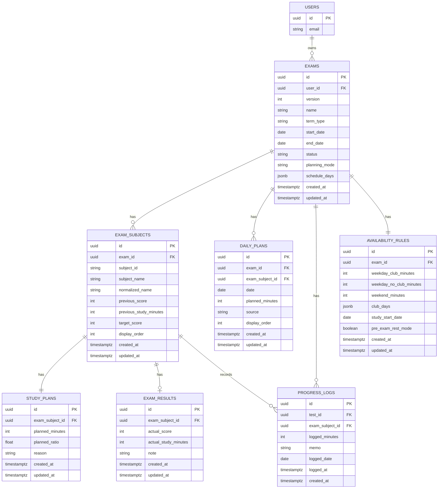
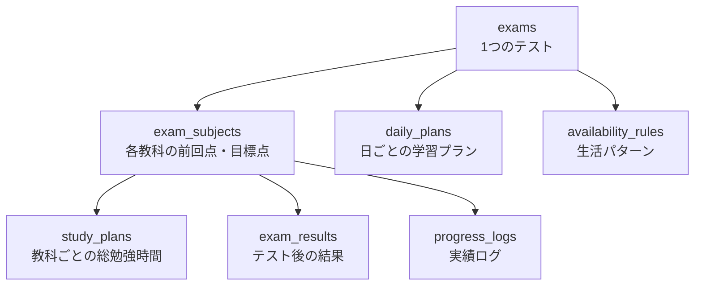

# DATA_STRUCTURES

## 方針
- 保存単位は `テスト` を中心にする
- 日次の細かすぎる行動ログはMVPでは持たない
- 次回提案に必要な最小構造だけを持つ
- MVPでも、責務が異なるものはテーブルを分ける
- 転職用ポートフォリオとして、検索・集計・拡張しやすい構造を優先する

## DB可視化

### MVPの保存モデル

### テーブルの役割

- `exams`
  - テスト自体の基本情報
- `exam_subjects`
  - そのテストに含まれる科目と目標値
- `study_plans`
  - 教科ごとの総勉強時間
- `daily_plans`
  - 日ごとの学習計画
- `progress_logs`
  - 実績ログ
- `exam_results`
  - テスト後の結果
- `availability_rules`
  - 自動配分用の生活パターン

### ねらい

- `exams`
  - テスト自体の状態遷移を管理する
- `exam_subjects`
  - 「科目そのもの」ではなく「そのテストにおける科目情報」を表す
- `daily_plans`
  - 日付単位の表示・更新をしやすくする
- `progress_logs`
  - 実績は追記型で別保存する
- 導出値
  - `logged_minutes` の累計
  - `remaining_minutes`
  - 進捗率
  は保存せず、`progress_logs` 集計で出す

### 補足

- `schedule_days` は MVP では `exams` に JSON で保持してよい
- 理由:
  - テスト期間内の補助情報であり、独立検索の必要度が低い
  - 一方で `exam_subjects` や `daily_plans` は検索・更新単位として独立価値が高い

## テーブル定義

### users

| 項目 | 型 | 必須 | 意味 | 例 | 備考 |
|---|---|---|---|---|---|
| `id` | `uuid` | はい | ユーザーを一意に識別するID | `8f3...` | Supabase Auth の `auth.users.id` を参照 |
| `email` | `string` | いいえ | ログインユーザーのメールアドレス | `user@example.com` | ゲスト利用時は未保持でもよい |

### exams

| 項目 | 型 | 必須 | 意味 | 例 | 備考 |
|---|---|---|---|---|---|
| `id` | `uuid` | はい | テストを一意に識別するID | `exam_001` | 主キー |
| `user_id` | `uuid` | はい | このテストの所有者 | `8f3...` | `users.id` を参照 |
| `version` | `int` | はい | 保存形式や更新競合を扱うための版番号 | `1` | 将来の migration 用 |
| `name` | `string` | はい | テスト名 | `2学期中間テスト` | ユーザー表示に使う |
| `term_type` | `string` | はい | 学期区分 | `midterm` | `中間 / 期末 / その他` 相当 |
| `start_date` | `date` | はい | テスト開始日 | `2026-06-20` | ホームの残日数計算に使う |
| `end_date` | `date` | はい | テスト終了日 | `2026-06-22` | `finished` 判定に使う |
| `status` | `string` | はい | テストの進行状態 | `planning` | `planning / active / finished / archived` |
| `planning_mode` | `string` | はい | 配分作成方法 | `auto` | `auto / manual` |
| `schedule_days` | `jsonb` | いいえ | テスト期間中の勉強可能日情報 | `[{ date: "...", subjects: [...] }]` | MVPでは JSON 保持 |
| `created_at` | `timestamptz` | はい | 作成日時 | `2026-04-22T10:00:00Z` | 監査用 |
| `updated_at` | `timestamptz` | はい | 最終更新日時 | `2026-04-22T10:30:00Z` | 更新順表示にも使える |

### exam_subjects

| 項目 | 型 | 必須 | 意味 | 例 | 備考 |
|---|---|---|---|---|---|
| `id` | `uuid` | はい | テスト内の科目行を一意に識別するID | `exsub_001` | 主キー |
| `exam_id` | `uuid` | はい | どのテストに属する科目か | `exam_001` | `exams.id` を参照 |
| `subject_id` | `string` | はい | 科目の安定識別子 | `math` | 表示名変更後も不変 |
| `subject_name` | `string` | はい | 科目の表示名 | `数学` | UI 表示用 |
| `normalized_name` | `string` | はい | 表記ゆれ吸収後の検索用名称 | `数学` | `数` などを正規化した値 |
| `previous_score` | `int` | いいえ | 前回の点数 | `72` | 引き継ぎ用 |
| `previous_study_minutes` | `int` | いいえ | 前回この科目に使った勉強時間 | `180` | 配分計算入力 |
| `target_score` | `int` | はい | 今回の目標点数 | `80` | 目標入力画面で設定 |
| `display_order` | `int` | はい | UI 上の表示順 | `1` | 並び順を安定させる |
| `created_at` | `timestamptz` | はい | 作成日時 | `2026-04-22T10:00:00Z` | 監査用 |
| `updated_at` | `timestamptz` | はい | 最終更新日時 | `2026-04-22T10:10:00Z` | 変更追跡用 |

### study_plans

| 項目 | 型 | 必須 | 意味 | 例 | 備考 |
|---|---|---|---|---|---|
| `id` | `uuid` | はい | 教科別配分の識別子 | `plan_001` | 主キー |
| `exam_subject_id` | `uuid` | はい | どの科目の配分か | `exsub_001` | `exam_subjects.id` を参照 |
| `planned_minutes` | `int` | はい | その科目に充てる総勉強時間 | `240` | 分単位 |
| `planned_ratio` | `float` | はい | 全体に対する配分比率 | `0.32` | 0〜1 を想定 |
| `reason` | `string` | いいえ | その配分になった理由 | `前回未達で目標差分が大きい` | 説明表示用 |
| `created_at` | `timestamptz` | はい | 作成日時 | `2026-04-22T10:15:00Z` | 監査用 |
| `updated_at` | `timestamptz` | はい | 最終更新日時 | `2026-04-22T10:15:00Z` | 再計算時に更新 |

### daily_plans

| 項目 | 型 | 必須 | 意味 | 例 | 備考 |
|---|---|---|---|---|---|
| `id` | `uuid` | はい | 日ごとの学習プラン行ID | `daily_001` | 主キー |
| `exam_id` | `uuid` | はい | どのテストの日程か | `exam_001` | `exams.id` を参照 |
| `exam_subject_id` | `uuid` | はい | どの科目の行か | `exsub_001` | `exam_subjects.id` を参照 |
| `date` | `date` | はい | その学習を行う日 | `2026-06-10` | ホームの「今日やること」に使う |
| `planned_minutes` | `int` | はい | その日に予定している勉強時間 | `60` | 分単位 |
| `source` | `string` | はい | 自動生成か手動追加か | `auto` | `auto / manual` |
| `display_order` | `int` | はい | 同日の中での表示順 | `2` | UI 安定用 |
| `created_at` | `timestamptz` | はい | 作成日時 | `2026-04-22T10:20:00Z` | 監査用 |
| `updated_at` | `timestamptz` | はい | 最終更新日時 | `2026-04-22T10:20:00Z` | 手動編集時に更新 |

### progress_logs

| 項目 | 型 | 必須 | 意味 | 例 | 備考 |
|---|---|---|---|---|---|
| `id` | `uuid` | はい | 実績ログの識別子 | `log_001` | 主キー |
| `test_id` | `uuid` | はい | どのテストに対する実績か | `exam_001` | `exams.id` を参照 |
| `exam_subject_id` | `uuid` | はい | どの科目の実績か | `exsub_001` | `exam_subjects.id` を参照 |
| `logged_minutes` | `int` | はい | 実際に勉強した時間 | `45` | 分単位 |
| `memo` | `string` | いいえ | 補足メモ | `問題集を2章進めた` | 任意入力 |
| `logged_date` | `date` | はい | どの日の実績として扱うか | `2026-06-10` | 日付集計用 |
| `logged_at` | `timestamptz` | はい | 記録した正確な時刻 | `2026-06-10T20:10:00Z` | 作成時刻とは用途が違う |
| `created_at` | `timestamptz` | はい | DB 保存日時 | `2026-06-10T20:10:01Z` | 監査用 |

### exam_results

| 項目 | 型 | 必須 | 意味 | 例 | 備考 |
|---|---|---|---|---|---|
| `id` | `uuid` | はい | 結果行の識別子 | `result_001` | 主キー |
| `exam_subject_id` | `uuid` | はい | どの科目の結果か | `exsub_001` | `exam_subjects.id` を参照 |
| `actual_score` | `int` | はい | 実際の点数 | `78` | 結果入力画面で使う |
| `actual_study_minutes` | `int` | いいえ | 実際に使った総勉強時間 | `220` | 振り返り用 |
| `note` | `string` | いいえ | 振り返りメモ | `計算ミスが多かった` | 任意入力 |
| `created_at` | `timestamptz` | はい | 作成日時 | `2026-06-25T12:00:00Z` | 監査用 |
| `updated_at` | `timestamptz` | はい | 最終更新日時 | `2026-06-25T12:05:00Z` | 再編集時に更新 |

### availability_rules

| 項目 | 型 | 必須 | 意味 | 例 | 備考 |
|---|---|---|---|---|---|
| `id` | `uuid` | はい | 生活パターン設定の識別子 | `rule_001` | 主キー |
| `exam_id` | `uuid` | はい | どのテスト用の生活ルールか | `exam_001` | `exams.id` を参照 |
| `weekday_club_minutes` | `int` | はい | 部活がある平日に使える勉強時間 | `60` | 分単位 |
| `weekday_no_club_minutes` | `int` | はい | 部活がない平日に使える勉強時間 | `120` | 分単位 |
| `weekend_minutes` | `int` | はい | 土日に使える勉強時間 | `180` | 分単位 |
| `club_days` | `jsonb` | はい | 部活がある曜日一覧 | `["mon", "wed", "fri"]` | MVPでは JSON 保持 |
| `study_start_date` | `date` | はい | 勉強開始日 | `2026-06-01` | 配分計算の開始点 |
| `pre_exam_rest_mode` | `boolean` | はい | 前日に休み寄せを行うか | `true` | 自動配分のオプション |
| `created_at` | `timestamptz` | はい | 作成日時 | `2026-04-22T10:05:00Z` | 監査用 |
| `updated_at` | `timestamptz` | はい | 最終更新日時 | `2026-04-22T10:05:00Z` | 変更追跡用 |

## Test
- id
- version
- name
- term_type
  - 中間 / 期末 / その他
- start_date
- end_date
- schedule_days[]
- status
  - planning / active / finished / archived
- planning_mode
  - auto / manual

## ScheduleDay
- date
- subjects[]

## Subject
- subject_id
- subject_name
- normalized_name
- previous_score
- previous_study_minutes
- target_score

## StudyPlan
- subject_id
- recommended_minutes
- recommended_ratio
- reason

## UserAvailability
- weekday_club_minutes
- weekday_no_club_minutes
- weekend_minutes
- club_days[]
- study_start_date
- pre_exam_rest_mode
  - true / false

## ProgressLog
- id
- test_id
- exam_subject_id
- logged_minutes
- memo
- logged_date
- logged_at

## DailyPlan
- id
- exam_id
- exam_subject_id
- date
- planned_minutes
- source
  - auto / manual

## ExamResult
- id
- exam_subject_id
- actual_score
- actual_study_minutes
- note

## Migration
- from_version
- to_version
- migrated_at

## SpecialCase（MVPでは未実装）
- date
- override_minutes
- override_mode
  - none / less / more / no_club
- memo

## 計算に使う入力
- 前回点数
- 前回勉強時間
- 今回目標点数
- 利用可能時間
- 勉強開始日
- テスト日程
- 進捗登録済み時間
- 部活日

## 計算に使わないもの
- 他人の点数
- 偏差値
- 学校順位
- 性格推定値

## 補足
- `logged_minutes` と `remaining_minutes` は保存値として持たず、`progress_logs` 集計から導出する
- `subject_id` は表示名変更後も不変とする
- 同一 `test` 内で科目重複を禁止する
- `manual` 行の追加は既存 `exam_subject_id` に対してのみ許可する
- `manual` 行は再計算で上書きしない
- 後で複雑化しやすいのは `単元`, `日次ログ`, `通知`, `外部カレンダー連携`
- MVPでは持たない
