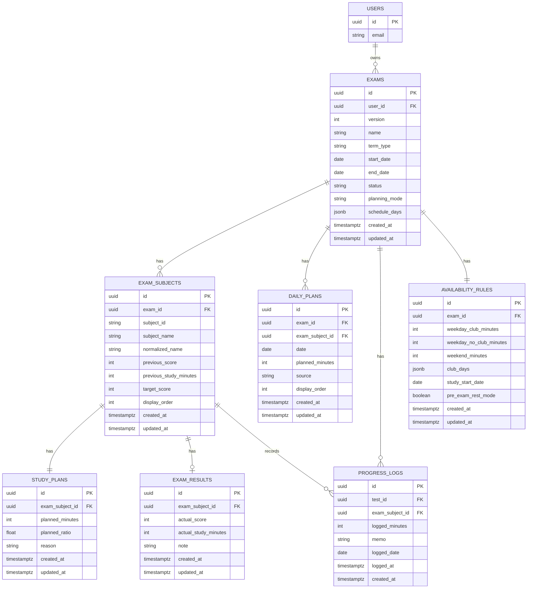
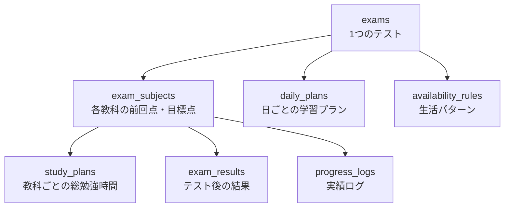

# DATA_STRUCTURES

## 方針
- 保存単位は `テスト` を中心にする
- 日次の細かすぎる行動ログはMVPでは持たない
- 次回提案に必要な最小構造だけを持つ
- MVPでも、責務が異なるものはテーブルを分ける
- 転職用ポートフォリオとして、検索・集計・拡張しやすい構造を優先する

## DB可視化

### MVPの保存モデル

### テーブルの役割

- `exams`
  - テスト自体の基本情報
- `exam_subjects`
  - そのテストに含まれる科目と目標値
- `study_plans`
  - 教科ごとの総勉強時間
- `daily_plans`
  - 日ごとの学習計画
- `progress_logs`
  - 実績ログ
- `exam_results`
  - テスト後の結果
- `availability_rules`
  - 自動配分用の生活パターン

### ねらい

- `exams`
  - テスト自体の状態遷移を管理する
- `exam_subjects`
  - 「科目そのもの」ではなく「そのテストにおける科目情報」を表す
- `daily_plans`
  - 日付単位の表示・更新をしやすくする
- `progress_logs`
  - 実績は追記型で別保存する
- 導出値
  - `logged_minutes` の累計
  - `remaining_minutes`
  - 進捗率
  は保存せず、`progress_logs` 集計で出す

### 補足

- `schedule_days` は MVP では `exams` に JSON で保持してよい
- 理由:
  - テスト期間内の補助情報であり、独立検索の必要度が低い
  - 一方で `exam_subjects` や `daily_plans` は検索・更新単位として独立価値が高い

## Test
- id
- version
- name
- term_type
  - 中間 / 期末 / その他
- start_date
- end_date
- schedule_days[]
- status
  - planning / active / finished / archived
- planning_mode
  - auto / manual

## ScheduleDay
- date
- subjects[]

## Subject
- subject_id
- subject_name
- normalized_name
- previous_score
- previous_study_minutes
- target_score

## StudyPlan
- subject_id
- recommended_minutes
- recommended_ratio
- reason

## UserAvailability
- weekday_club_minutes
- weekday_no_club_minutes
- weekend_minutes
- club_days[]
- study_start_date
- pre_exam_rest_mode
  - true / false

## ProgressLog
- id
- test_id
- exam_subject_id
- logged_minutes
- memo
- logged_date
- logged_at

## DailyPlan
- id
- exam_id
- exam_subject_id
- date
- planned_minutes
- source
  - auto / manual

## ExamResult
- id
- exam_subject_id
- actual_score
- actual_study_minutes
- note

## Migration
- from_version
- to_version
- migrated_at

## SpecialCase（MVPでは未実装）
- date
- override_minutes
- override_mode
  - none / less / more / no_club
- memo

## 計算に使う入力
- 前回点数
- 前回勉強時間
- 今回目標点数
- 利用可能時間
- 勉強開始日
- テスト日程
- 進捗登録済み時間
- 部活日

## 計算に使わないもの
- 他人の点数
- 偏差値
- 学校順位
- 性格推定値

## 補足
- `logged_minutes` と `remaining_minutes` は保存値として持たず、`progress_logs` 集計から導出する
- `subject_id` は表示名変更後も不変とする
- 同一 `test` 内で科目重複を禁止する
- `manual` 行の追加は既存 `exam_subject_id` に対してのみ許可する
- `manual` 行は再計算で上書きしない
- 後で複雑化しやすいのは `単元`, `日次ログ`, `通知`, `外部カレンダー連携`
- MVPでは持たない
